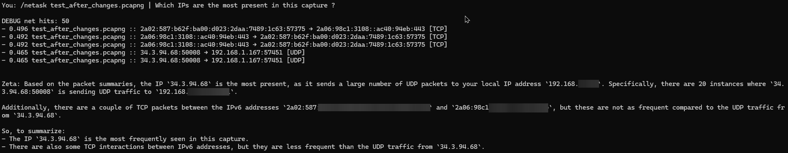
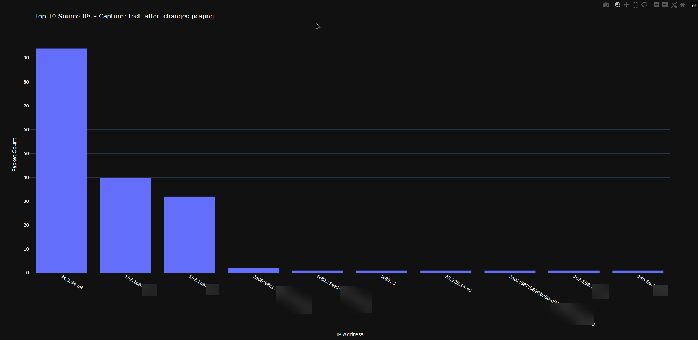
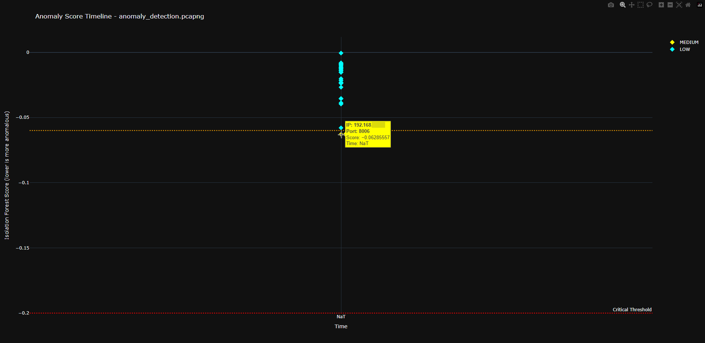
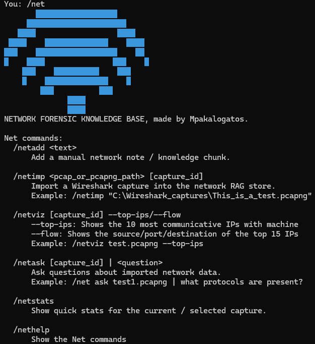

# 🛡️ Project Sairene: AI-Driven Network Forensic Analysis

## 📒 1. Abstract

Project Sairene is a distributed Client–Server application designed for intelligent network forensic analysis and real-time threat hunting.

The system transforms raw packet captures (PCAP/PCAPNG) into structured, queryable telemetry and augments them with Retrieval-Augmented Generation (RAG) to produce contextualized security insights.

Instead of simply displaying packet data, Sairene introduces a semantic reasoning layer over network traffic, enabling analysts to interpret complex activity patterns with greater clarity and speed.

  

-----------------------------------------------------------------------------------------------------------------------------------------------------------------------------------------------------------------
## 🚀 Latest Updates
This version introduces significant architectural improvements to the Local Memory Service and the PCAP ingestion pipeline, focusing on high-performance vector search and robust data processing.

### 🧠 Performance & Scalability
- RAM-Based Vector Search: The FAISS index is now managed as a Singleton and cached in memory. This eliminates the overhead of reading the index from disk for every query, ensuring sub-millisecond search times regardless of dataset size.

- Batch Database Retrieval: Replaced "N+1" query patterns with optimized batch SQL requests. When retrieving search results, the system now fetches all metadata in a single database trip rather than multiple individual queries.

- SQL Indexing: Added explicit indices on frequently searched columns like faiss_row and capture_id to maintain speed as the database grows.

### 🛠️ Stability & Bug Fixes
- ICMP/DNS Logic Separation: Fixed a critical bug in the PCAP ingester where DNS parsing was incorrectly nested inside ICMP logic. The system can now process ICMP packets (pings) without crashing and correctly identifies DNS queries across UDP and TCP.

- Database Schema Alignment: Resolved a mismatch in the init_db function to ensure the embedding BLOB column is correctly created and populated.

- Safe Shutdowns: Implemented FastAPI shutdown handlers to ensure the in-memory FAISS index is successfully flushed to disk whenever the service stops.

- Reliable Index Rebuilding: Fixed a syntax error (fetchball typo) in the index maintenance tool, allowing for safe index reconstruction from the SQLite database.

### 📡 Enhanced Network Intelligence
Improved DNS Visibility: The ingestion engine now reliably extracts and stores DNS query names. This provides much deeper context for security analysis and semantic searching of network logs.

## ✍🏻 What is next:
Im thinking of changing the architecture of the app from Python to Rust for speed

-----------------------------------------------------------------------------------------------------------------------------------------------------------------------------------------------------------------

## 🏗️ 2. System Architecture

Project Sairene follows a distributed architecture separating ingestion, storage, and reasoning from analyst interaction.

      ┌──────────────┐
      │     PCAP     │
      └──────┬───────┘
             │
             ▼
      ┌──────────────────────────┐
      │ Server (Ingestion & API) │
      └──────┬───────────────────┘
             │
             ▼
      ┌──────────────────────────┐
      │ Structured Network Memory│
      └──────┬───────────────────┘
             │
             ▼  
      ┌───────────────────────────────────────┐
      │ML Anomaly Detection (Isolation Forest)│
      └──────┬────────────────────────────────┘
             │
             ▼
      ┌──────────────────────────┐
      │   LLM Reasoning (RAG)    │
      └──────┬───────────────────┘
             │
             ▼
      ┌──────────────────────────┐
      │ Client & Visualizations  │
      └──────────────────────────┘

Server (Debian / Proxmox):

  - PCAP ingestion
  - Parsing via Scapy
  - Structured metadata extraction
  - Storage in SQLite (JSON-enabled)
  - REST API built with FastAPI
  
The server acts as the persistent network memory core.

Client (Windows 11):

  - CLI-based analyst interface
  - Interactive visualizations using Plotly
  - Local LLM orchestration via Ollama

The client is responsible for:

  - 1. Command execution
  - 2. Data visualization
  - 3. Context-aware querying
  - 4. LLM interaction

## 🔑 3. Key Features & Methodology
  ### A. Retrieval-Augmented Generation (RAG)

  Command: /netask <query>
  
  The system does not operate as a generic chatbot.
  
  - Workflow:
  
    - User submits a security-related query.
    - The server retrieves relevant packet records from the database.
    - Structured results are injected into the LLM context.
    - The LLM generates an answer grounded in actual capture data.
    
  This prevents hallucination and ensures that reasoning remains evidence-based.
  
  LLM Model:
  
    Qwen (via Ollama)

  

    
  

  ### B. Structured Behavioral Analysis

  Sairene converts packet-level telemetry into structured, queryable representations.
  
  Analytical capabilities include:
  
  - **Who is talking to whom:** Maps out the path from the starting device to the destination.
  - **What "doors" are being used:** Tracks which ports (like web browsing) are active.Port usage distribution
  - **Where the traffic is piling up:** Pinpoints areas where the network is getting crowded.
  - **Who the "loudest" users are:** Quickly identifies the devices using the most data.
  - **What languages are being spoken:** Breaks down which protocols (the rules for communication) are being used most often.
    
  This allows analysts to move from raw packets to interaction-level reasoning.

  ### C. Interactive Visualizations

  Visual abstractions enhance interpretability.
  
  Sankey Diagrams
  
    Source → Port → Destination flow modeling

  

    
  

  
  Dynamic Bar Charts
  
    Top talkers
    Protocol distribution
    Real-time traffic statistics

  

    
  

  
  All visualizations are rendered via Plotly for interactive exploration.

  ### D. Machine Learning Anomaly Detection (Isolation Forest)
  Sairene uses an **Isolation Forest** algorithm to identify outliers in network traffic without requiring pre-labeled attack signatures.
  - **Logic:** The model isolates anomalies based on feature deviations (for example, unusual port-to-IP fan-out, packet frequency).
  - **Threat Scoring:** Each flow is assigned a score. Sairene categorizes these into **CRITICAL, HIGH, MEDIUM,** or **LOW** threat levels based on statistical distance.

  

    
  

  
## ⌨️ 4. Commands & Usage

  | Command                | Description                                                                 |
  | ---------------------- | --------------------------------------------------------------------------- |
  | `/netimport <file>`    | Parses a PCAP/PCAPNG file and synchronizes it with the server database.     |
  | `/netstats`            | Displays high-level statistics of the current capture.                      |
  | `/netviz --anom`| Runs ML detection and generates an interactive anomaly timeline.       |
  | `/netviz --flow`       | Generates an interactive Sankey diagram of network flows.                   |
  | `/netviz --top-ips`    | Generates an interactive Bar graph of the top 10 present IPs.               |
  | `/netask [capture_id]` | Performs a RAG-based forensic analysis using Qwen 2.5.                      |
  | `/neofetch`            | Displays local and server system telemetry.                                 |

  

    
  

## 📥 5. Installation & Setup

  - Server Side:

    - 1. Install TShark
         
    - 2. Install dependencies:
         pip install -r server/requirements_server.txt
         
    - 3. Run the FastAPI server:
         uvicorn app:app --host 0.0.0.0 --port 8000

  - Client Side:

    - 1. Install Ollama
         
    - 2. Pull the LLM model:
         ollama pull qwen2.5
         
    - 3. Install client dependencies:
         pip install -r client/requirments_client.txt
